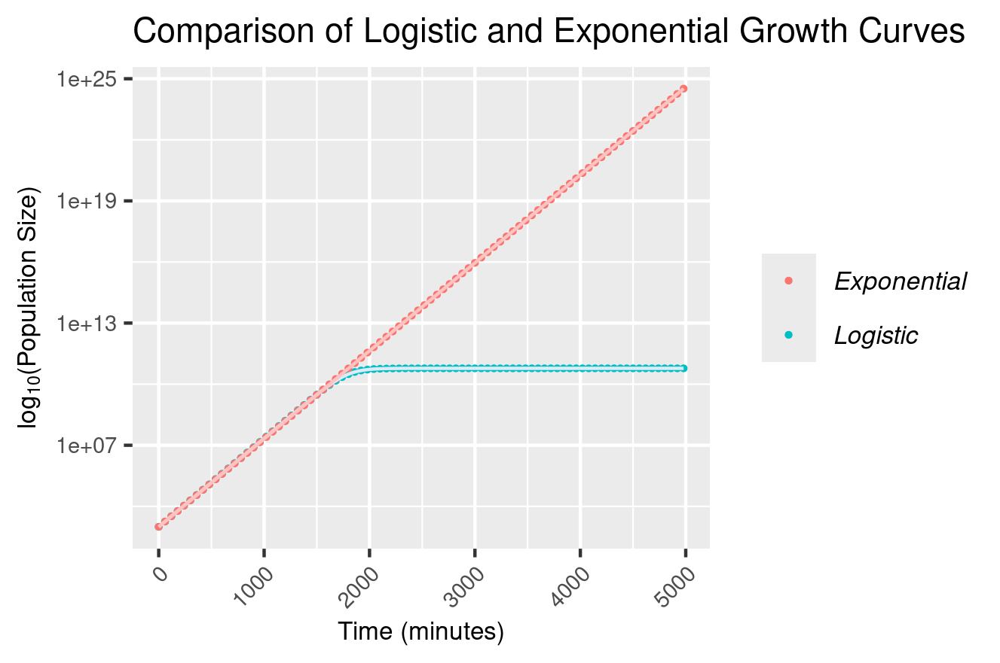

# Question 1 #
Annotate the README.md file in your logistic_growth repo with more detailed information about the analysis. Add a section on the results and include the estimates for N0, r and K (mention which *.csv file you used)

## Data ## 
Raw data can be found in the experiment.csv file

Data was downloaded off (https://osf.io) 

The dataframe contains two columns, the time (in minutes) since the culture was mixed with the growth medium and the population size of the bacteria culture at that point in time. 

### Overview ### 
The data represents a simulation of logistic growth in a culture of _Escherichia coli_. The culture is expected to show logistic growth as there is a fixed concentration of resources in the growth medium. As a result, the population experiences initial exponential growth when the concentration of resources in the environment does not limit the rate of growth of the population. However, as the concentration of resources declines with increasing consumption and a greater population size, the size of the population begins to plateau and reaches a carrying capacity in the environment. This code aims to evaluate a model for logsitic growth based on parameters estimated from linear models on the data before seeing how well this traces over the raw data itself.  

### Plotting raw data in plot_data.R ###
The first script of the analysis visualises the raw data pattern of growth from the experiment csv file through the plotting of two graphs, using the package ggplot 2. 

The first graph plots the culture population against time, displaying a clear sigmoidal shaped curve and logistic realtionship between the two variables. 
The second graph plots the same data but with the addition of a log base 10 transformation on the population y axis. This step creates a semi-log plot and results in the exponential stage of the logistic growth being represented as a straight line that then plateaus before reaching the population carrying capacity. 

### Fitting linear models in fit_linear_model.R ###
This script aims to measure the required logistic growth model parameters of: starting population size (N0), the exponential growth rate (r) and the carrying capacity of the population (K) from linear models applied to the raw data. Two linear models are applied and evaluated in this script. 

Note: This script requires the dplyr package that enables piping to be used within the code. 

The first linear model is used to measure the exponential growth rate and the starting population size of the growth culture of _E.coli._ This step is modelled on the exponential stage of the culture growth. To section this period off, and convert the exponential stage to a linear relationship appropriate for linear analysis, the data was subsetted followed by the addition of a column represeting the log of the population size. Visualised on the second graph of the plot_data.R script, the time of the data were subsetted to only include values below 1500 minutes, identifying the exponential stage of the growth. Following this an additional column to the subsetted data was added that displayed the log base e of the population size at each respective time interval. After running and summarising a linear model on this now linear relationship between time and the natural log of the population size (N), the model intercept indicated the natural log of the starting population (N0) while the gradient indicated the growth rate (r). 

The second model of this script was run on the plateaued stage of the logistic growth curve seen in plot_data.R. This did not make use of a log transformation and ran a linear model between the population size and 1 (based on the assumption that the line was completely horizontal). The data was subsetted where only time values above 2500 were included in order to identify only the section of the growth curve where the population size (N) equalled that of the carrying capacity. After running and summarising this model, the model intercept informed of the carrying capacity of the population (K). 

### Plotting logistic growth over data in plot_data_and_model.R ###
This script forms a function for logistic growth requiring the calculated parameters of: starting population size (N0), the growth rate (r) and the carrying capacity of the population (K). These calculated parameters from the simulated _E.coli_ data were inputted into this function, producing a model logistic growth curve. This model curve was then plotted twice. Once on top of the raw data from the experiment.csv file, with both no log transformation applied to the population y axis, and then a log base 10 transformation applied to the population y axis, just as in the first script. The logistic growth curve function was based upon the theory outlined in the README.md file of this repository: https://github.com/josegabrielnb/reproducible_research. 
 

## Results found from linear models and placed into logistic growth function ## 
N0 (starting population size of the culture) = 987 (3sf) 

r (growth rate) = 0.0100 (3sf) 

K (carrying capacity) = 6x10^10

The logistic function curve produced a fit very closely matching the observations of the raw simulated data.

# Question 2 # 
Use your estimates of N0 and r to calculate the population size at t = 4980 min, assuming that the population grows exponentially. How does it compare to the population size predicted under logistic growth?

### Answer ###
An exponential model of bacterial growth assumes that the rate of population increase at any given time is proportional to the population size and the exponential growth rate. Therefore the population does not experience a carrying capacity plateau and the gradient continues to rise through time. In exponential growth, the population experiences a compound increase per unit time. A exponential growth rate results in the addition of the same proportion of the population in each successive time intervals. Therefore, as the population grows, the number of individuals being added after each time interval increases. 

The equation for exponential growth can be represented as can be represented as
`N = N0(1+r)^t`

Where:

N0 = starting population size of the culture

r = growth rate

K = carrying capacity

Therefore the population size of the bacteria culture at 4980 minutes = 987 x (1+0.0100)^ 4980

= 3.27 x10^24 (3sf)

# Question 3 #
Add an R script to your repository that makes a graph comparing the exponential and logistic growth curves (using the same parameter estimates you found). Upload this graph to your repo and include it in the README.md file so it can be viewed in the repo homepage. 

### Answers ###

Code and annotations can be found in the exponential_logistic_comparison.R file of the repository. 

Below shows the graph comparing the logistic model and exponential model of growth over the same time period the experiment.csv data was simulated for. In order to not have the raw simulated data also on the plot, this script created a new data frame from the time periods outlined in the raw data, with the addition of the predicted population sizes for each model at each respective time interval. This dataframe was then plotted with the addition of the function lines to link the data points. A log base 10 transformation was added to enable greater visualisation of distinction between the two curves. This choice is due to the fact that without a log tranformation, the exponential population size counts dwarf those of the logistic growth and the pattern of logistic growth is challenging to view on the same plot. 

### Comparison graph: ###

